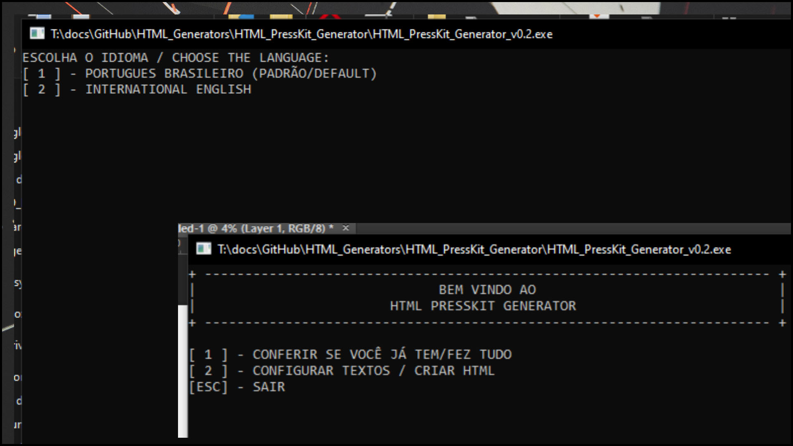
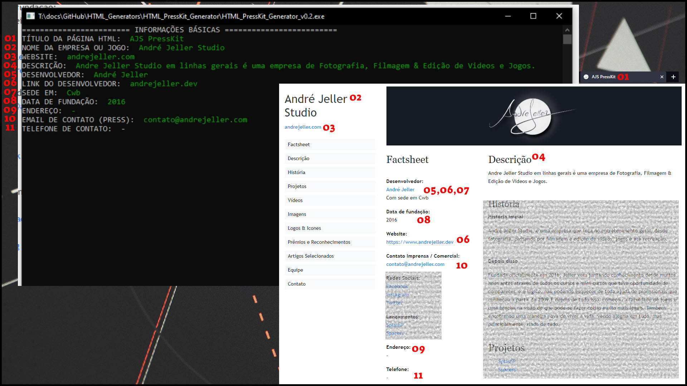
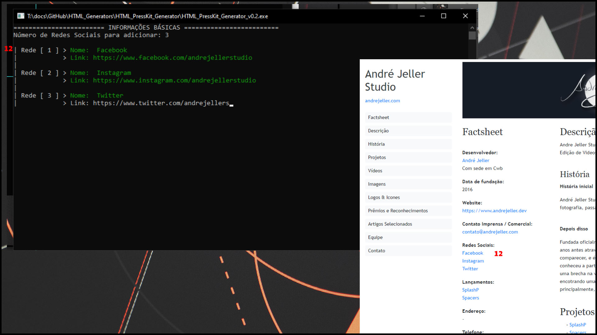
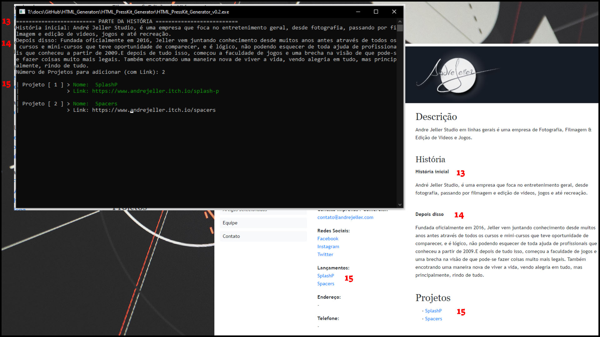
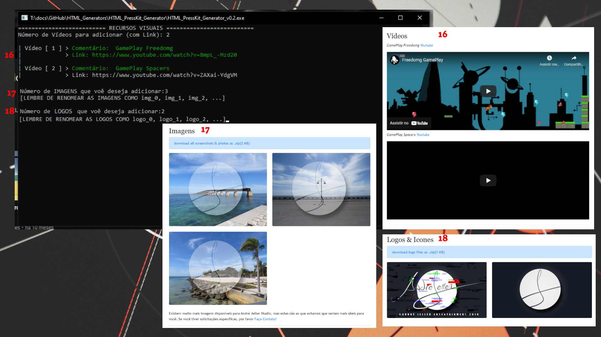
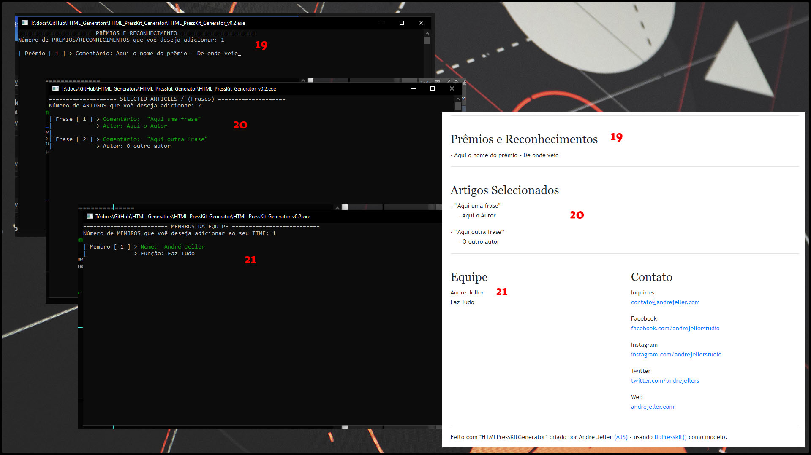
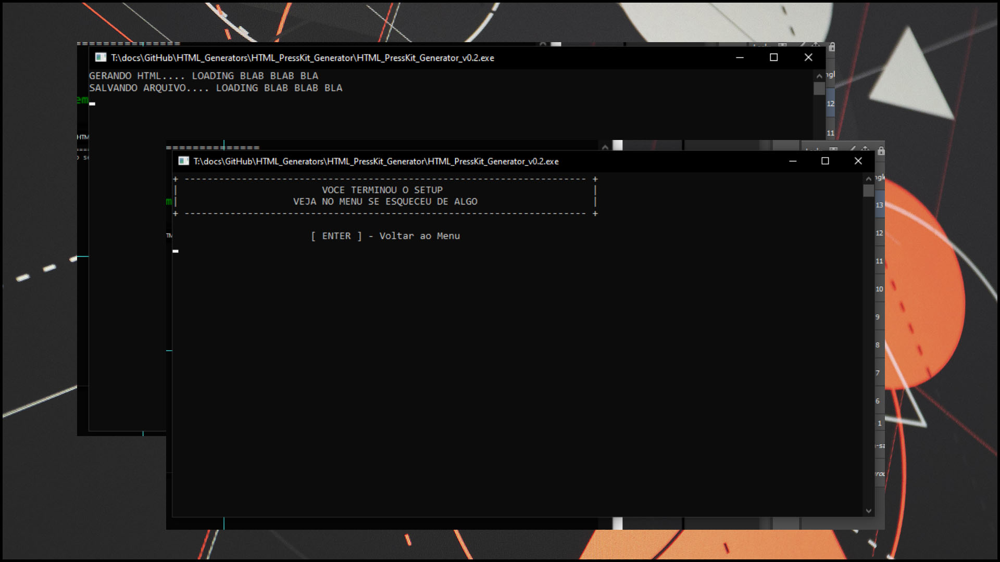

# HTML PressKit Generator

Language:
- (ptBR) Português BR
- (enUS) International English
---

#### | (ptBR) Português BR

[VEJA UMA DEMO DO RESULTADO](http://www.andrejeller.com/HTML_PressKit_Generator/)

_HTML PressKit Generator_ é uma forma de criar uma página [doPresskit()](http://dopresskit.com/) em html para a sua empresa sem a necessicade do uso de um servidor, local ou não, como em sua implementação [original](http://dopresskit.com/) ou em [presskit.html](https://pixelnest.io/products/presskit.html/).

As vantagens do _HTML PressKit Generator_ podem ser resumidas em:
- A não necessidade do uso de um servidor ou horpegadem php dinâmica.
Uma vez que geramos como arquivo final um **.HTML** estático, você pode facilmente utilizar o [GitHub Pages](https://pages.github.com/) como local de hospadagem a sua versão DoPressKit.
- A possibilidade de baixar os arquivos/códigos originais tanto para rodar direto deles (caso não se sinta seguro em rodar um .exe em seu computador), quanto para otimizar ou implementar novas funcionalidades caso sejam necessárias.

Com isso, sendo uma simples re-implementação do que foi criado por [Rami Ismail](https://twitter.com/tha_rami) da [Vlambeer](https://www.vlambeer.com/), ele foi criado para pessoas que não tem uma hospedagem ou dinheiro para (como eu não tinha) e também sem empenho ou conhecimento para instalar um servidor local e depois converter para html. 
Assim, não existe forma mais facil de explicar como ele funcionar além de "baixar e rodar o .exe", porém um pequeno tutorial estará presente em seguida. 
 
### Version Info:
- [v0.1] - The first code. A C++ prototype.
- [v0.2] - Now the code was remade and has input checks. Something like a python alfa.

### Recapitulando: Porquê eu preciso disso?
- Em [doPresskit](http://dopresskit.com/) você precisa de um servidor para que tudo seja automaticamente criado usando .php. Sim, você pode usar MPMP, XAMP, ..., mas o arquivo final continua em .php, ou seja, você precisa de um servidor para manter ele no ar.
- Já o [presskit.html](https://pixelnest.io/products/presskit.html/) vai fazer exatamente o que você possívelmente quer, que é criar um presskit.html, porém você vai precisar utilizar Node.js para que ele faça isso. Então se você não deseja instalar outros programas, ou não sabe como usar o Node.js aqui é o lugar certo.
- Então, com o _HTML PressKit Generator_ você só precisa rodar o executável e seguir as instruções sem instalar ou usar qualquer outra coisa, que no final você terá seu site html estático.

### Então vamos lá, como começar ?
1. Baixe o "_HTML_PressKit_Generator.exe_" deste repositório.
2. Rode o arquivo .exe.
3. Ele vai criar automaticamente a pasta (/images), e essa é a unica pasta que você irá precisar adicionar as coisas (arquivos). 
4. Agora, escolha o seu idioma: ptBR ou enUS.
5. Então no meu você vai ter 3 opções:
7. Aperte [ 1 ] - para ver de você já adicionou todos os arquivos de que precisa em /images.
8. Aperte [ 2 ] - para começar a preencher todas as informações necessárias sobre seu Jogo ou Empresa.
9. Aperte [ESC] - para sair do programa.
10. E é isso.
11. Quando você terminar todos os passos, um arquivo index.html será criado no diretório/pasta em que você rodou o programa.

### O Programa / O Resultado

 

#### Links 
- http://dopresskit.com/
- https://pages.github.com/

- https://pixelnest.io/products/presskit.html/
- https://twitter.com/tha_rami
- https://www.vlambeer.com/

---
#### | (enUS) International English

[SEE THE RESULT DEMO](http://www.andrejeller.com/HTML_PressKit_Generator/)

_HTML PressKit Generator_ is a way to create a [doPresskit()](http://dopresskit.com/) page in html for your company without the need to use a server, local or not, as in [original implementation](http://dopresskit.com/) or in [presskit.html](https://pixelnest.io/products/presskit.html/).

The advantages of _HTML PressKit Generator_ can be summarized in:
- No need to use a dynamic php server or host. Since we generate a static **.HTML** as a final file, you can easily use [GitHub Pages](https://pages.github.com/) as the hosting location for your DoPressKit version.
- The possibility of downloading the original files/codes both to run them directly (in case you don't feel safe running an .exe on your computer), as well as to optimize or implement new features if necessary.

With that, as it is a simple re-implementation of what was created by [Rami Ismail](https://twitter.com/tha_rami) of [Vlambeer](https://www.vlambeer.com/), it was created for people who don't have a hosting or money for (as I didn't) and also without the commitment or knowledge to install a local server and then convert to html.
Thus, there is no easier way to explain how it works than "download and run the .exe", but a small tutorial will be present next.

### Version Info:
- [v0.1] - The first code. A C++ prototype.
- [v0.2] - Now the code was remade and has input checks. Something like a python alfa.

### Recap: Why do i need this?
- On [doPresskit](http://dopresskit.com/) you need a server so everything is automatically created using .php. Yes, you can use MPMP, XAMP, ..., but the final file remains in .php, meaning you need a server to keep it up and running.
- The [presskit.html](https://pixelnest.io/products/presskit.html/) will do exactly what you possibly want, which is to create a presskit.html, but you will need to use Node.js to let him do that. So if you don't want to install other programs, or don't know how to use Node.js here is the right place.
- So, with _HTML PressKit Generator_ you just need to run the executable and follow the instructions without installing or using anything else, and in the end you will have your static html site.

### So here we go, how to start? ?
1. Download "_HTML_PressKit_Generator.exe_" from this same directory.
2. Run the .exe.
3. It will automatically create a folder (/images), and that is the only folder that you need to put the files.
4. Now choose your language: ptBR or enUS.
5. Now you are in the menu, and have 3 options.
6. Press [1] - to check the files you need.
7. Press [2] - to start, and fill all informations about your Game/Company
8. Press [ESC] - to exit the program.
9. That's it.
10. When you finish all the steps, a index.html will be created in the directory.

#### The 'Application' / The Resultado

 

#### Links 
- http://dopresskit.com/
- https://pages.github.com/

- https://pixelnest.io/products/presskit.html/
- https://twitter.com/tha_rami
- https://www.vlambeer.com/
